# 🧊 Box Mover Game 
**A responsive interactive game with keyboard and touch controls**

## 🌟 Features
| Feature | Implementation |
|---------|---------------|
| **Dual Controls** | Keyboard (WASD/Arrows) + Touch buttons |
| **Responsive Layout** | CSS Media Queries (`@media (max-width: 765px)`) |
| **Boundary Detection** | `window.innerWidth/innerHeight` calculations |
| **Smooth Movement** | CSS Transitions (`transition: 0.05s ease-in-out`) |

## 🎮 Controls
### Desktop

```mermaid
flowchart LR
    W[W/↑] --> Up
    A[A/←] --> Left
    S[S/↓] --> Down
    D[D/→] --> Right
    R[R] --> Reset
```

### Mobile

```mermaid
flowchart TB
    Touch[↑ → ↓ ←] --> Movement
    Center[⌖] --> Reset
```

## 📂 File Structure 
box-mover-game/
├── index.html      # Main HTML structure
├── style.css       # Responsive styling
│   ├── Desktop layout
│   └── Mobile grid (3x3)
└── script.js       # Event handlers
    ├── Keyboard inputs
    └── Touch controls
